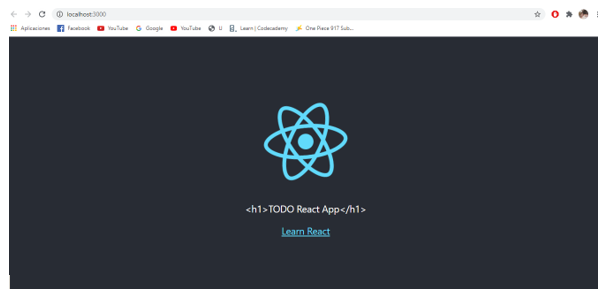
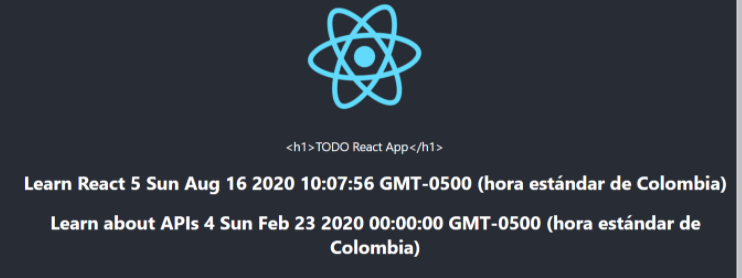
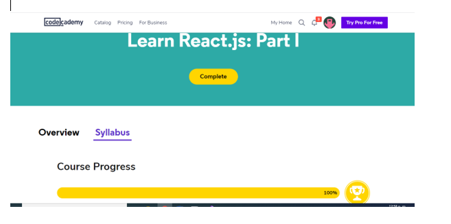
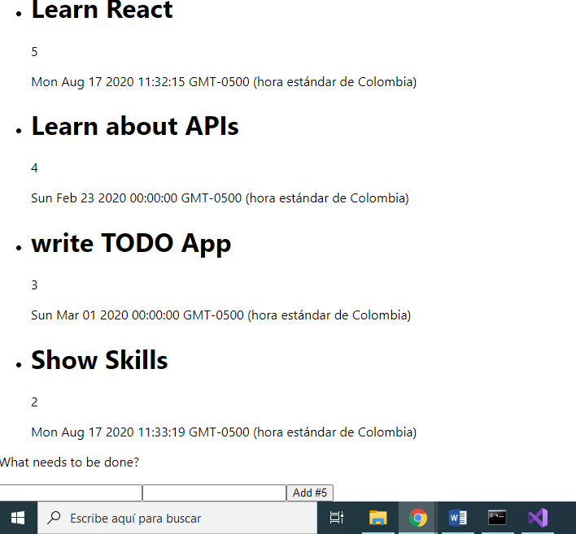

### Escuela Colombiana de Ingeniería
### Innovación y emprendimiento con TI

### Laboratorio 01 - Intro-React

### Codigo de honor:
Debes seguir el Código de honor del ingeniero de sistemas para defender el estándar de integridad académica de la ECI:

* Tus respuestas a tareas, cuestionarios y exámenes deben ser tu propio trabajo (excepto para las tareas que permiten explícitamente la colaboración).

* No puedes compartir tus soluciones de tareas, cuestionarios o exámenes con otra persona a menos que el instructor lo permita explícitamente. Esto incluye cualquier cosa escrita por ti, como también cualquier solución oficial proporcionada por el docente o el monitor del curso.

* No puedes participar en otras actividades que mejorarán de manera deshonesta tus resultados o que mejorarán de manera deshonesta o dañarán los resultados de otras personas.

**Como compilarlo**

`npm install`
`npm start`

### Part 1: Create a basic React application and understand React basics
Primera app react

### Part 2: Create React Components for the TODO App

Despues de crear los componentes y ponerlas a interactuar entre si obtenemos:

### Part 3: Interacting with React Components

Curso completo de Codecademy

Creación del formulario exitosa

### Authors

* **Mateo González**  - [mateu20](https://github.com/mateu20)

